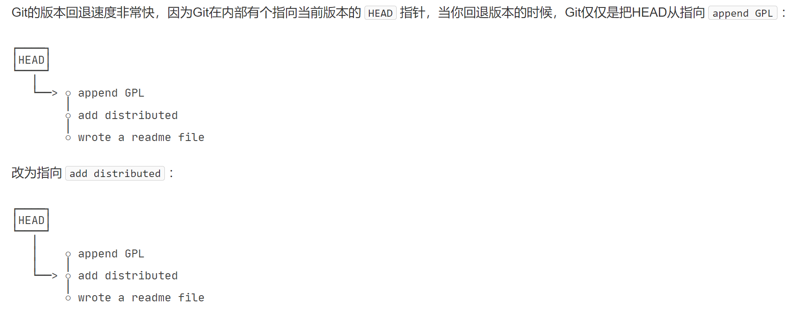
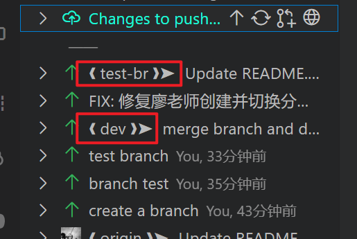
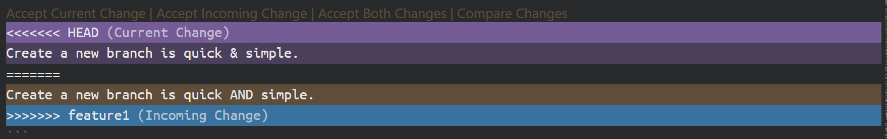
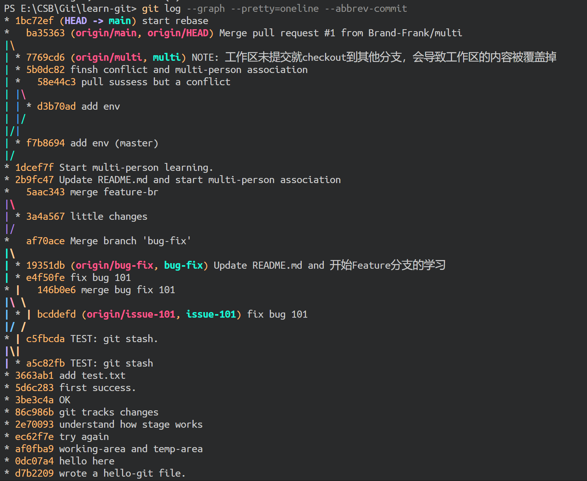
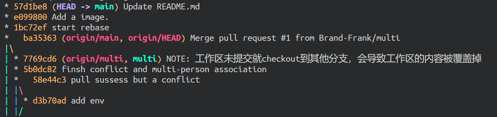
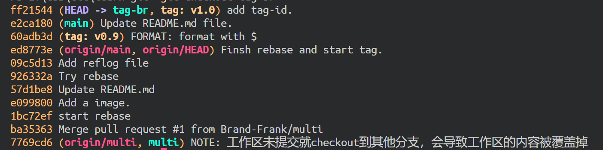
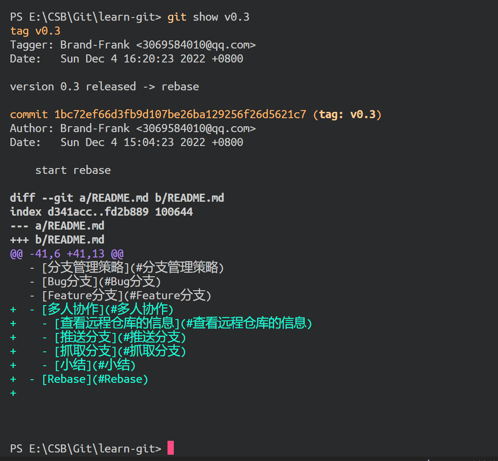
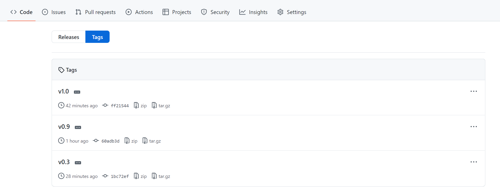
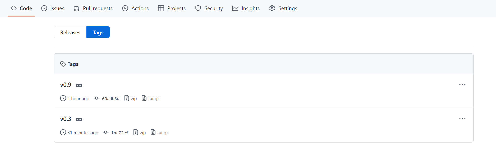
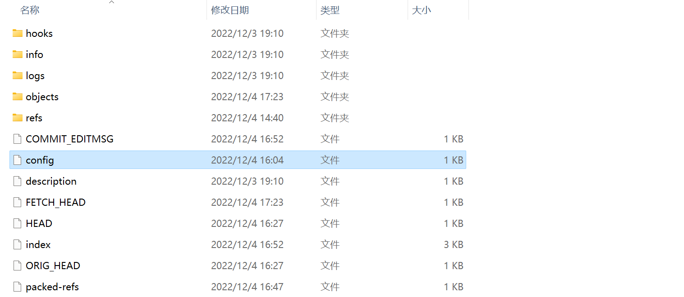

# learn-git
系统学习Git和GitHub

> 参考学习：
> - [廖雪峰的博客](https://www.liaoxuefeng.com/wiki/896043488029600)
> - [GitHub Docs](https://docs.github.com/cn)
> - [Git-Cheat-Sheet](https://github.com/flyhigher139/Git-Cheat-Sheet)

<p style="font-size: 1.5rem; text-align: center">目录</p>

- [learn-git](#learn-git)
  - [Git简介](#git简介)
    - [初始化账户](#初始化账户)
    - [初始化版本库](#初始化版本库)
    - [添加文件](#添加文件)
    - [查看状态](#查看状态)
    - [编辑文件并查看区别](#编辑文件并查看区别)
    - [再次提交与查看状态](#再次提交与查看状态)
    - [查看日志](#查看日志)
  - [Git本地仓库管理](#git本地仓库管理)
    - [退回到上一个版本](#退回到上一个版本)
    - [退回到未来的版本](#退回到未来的版本)
    - [工作区和暂存区](#工作区和暂存区)
    - [Git只追踪修改，而非文件](#git只追踪修改而非文件)
    - [查看工作区和版本库里最新版本的区别](#查看工作区和版本库里最新版本的区别)
    - [丢弃工作区的修改](#丢弃工作区的修改)
  - [远程仓库](#远程仓库)
    - [本地仓库与远程仓库建立关联](#本地仓库与远程仓库建立关联)
    - [推送至远程仓库](#推送至远程仓库)
    - [删除与远程仓库的绑定关系](#删除与远程仓库的绑定关系)
    - [从远程仓库克隆到本地](#从远程仓库克隆到本地)
  - [分支管理](#分支管理)
    - [创建与合并分支](#创建与合并分支)
      - [创建与切换dev分支](#创建与切换dev分支)
      - [列出所有分支](#列出所有分支)
      - [在分支上做出修改并提交](#在分支上做出修改并提交)
      - [切换回主分支(main)](#切换回主分支main)
      - [合并分支(dev)到主分支(main)](#合并分支dev到主分支main)
      - [删除分支(dev)](#删除分支dev)
      - [切换分支的另一种方式(switch)](#切换分支的另一种方式switch)
      - [dev分支上传到远程仓库](#dev分支上传到远程仓库)
      - [分支管理总结](#分支管理总结)
    - [解决冲突](#解决冲突)
    - [分支管理策略](#分支管理策略)
    - [Bug分支](#bug分支)
    - [Feature分支](#feature分支)
    - [多人协作](#多人协作)
      - [查看远程仓库的信息](#查看远程仓库的信息)
      - [推送分支](#推送分支)
      - [抓取分支](#抓取分支)
      - [小结](#小结)
    - [Rebase](#rebase)
  - [标签管理](#标签管理)
    - [创建标签](#创建标签)
    - [管理标签](#管理标签)
  - [Git自定义](#git自定义)
    - [让Git显示颜色](#让git显示颜色)
    - [配置git命令的别名](#配置git命令的别名)


## Git简介
### 初始化账户
```powershell
# 初始化账户
$ git config --global user.name "Brand-Frank"
$ git config --global user.email "123456789@qq.com"
```

### 初始化版本库
```powershell
$ git init
```

### 添加文件
```powershell
$ git add hello-git.txt
```

### 查看状态
```powershell
$ git status
```

### 编辑文件并查看区别
```powershell
$ git diff    #需要在git add之前查看，add之后看不到不同之处
```

### 再次提交与查看状态
```powershell
$ git add .
$ git status
```

### 查看日志
```powershell
$ git log
```
```powershell
commit 7c4bd2b3f63e63990b657f7ce67cd035c40e2dc5 (HEAD -> main)
Author: Brand-Frank <3069584010@qq.com>
Date:   Sat Dec 3 19:51:06 2022 +0800

    append GPL

commit f1ef8f3e4b2d11b2ca8cf1f65440635f02e38a2e
Author: Brand-Frank <3069584010@qq.com>
Date:   Sat Dec 3 19:48:04 2022 +0800

    add distributed

commit 06b98edccbf6c6115efcc86857a7bfc94f86b53f
Author: Brand-Frank <3069584010@qq.com>
Date:   Sat Dec 3 19:38:56 2022 +0800

    add a file.

commit d7b220918c360dc4f044532911498ef8c02f7b34
Author: Brand-Frank <3069584010@qq.com>
Date:   Sat Dec 3 19:36:41 2022 +0800

    wrote a hello-git file.

commit 30d25aaf35c014c4b4e309f3dbd2c3043bc6845b (origin/main, origin/HEAD)
Author: inTree <54088180+Brand-Frank@users.noreply.github.com>
Date:   Sat Dec 3 19:07:15 2022 +0800

    Update README.md

commit cd9255a9d6041daf8979aa228e4fb846e0e97baf
Author: inTree <54088180+Brand-Frank@users.noreply.github.com>
Date:   Sat Dec 3 19:05:08 2022 +0800

    Initial commit
```

- 简化方式查看日志
```powershell
$ git log --pretty=oneline
```
输出情况
```powershell
7c4bd2b3f63e63990b657f7ce67cd035c40e2dc5 (HEAD -> main) append GPL    # HEAD, will be delete
f1ef8f3e4b2d11b2ca8cf1f65440635f02e38a2e add distributed
06b98edccbf6c6115efcc86857a7bfc94f86b53f add a file.
d7b220918c360dc4f044532911498ef8c02f7b34 wrote a hello-git file.
30d25aaf35c014c4b4e309f3dbd2c3043bc6845b (origin/main, origin/HEAD) Update README.md
cd9255a9d6041daf8979aa228e4fb846e0e97baf Initial commit
```
- `7c4bd2b3f63e63990b657f7ce67cd035c40e2dc5`为`commit id`（版本号），是由SHA1计算出来的一个非常大的数字，十六进制表示

## Git本地仓库管理
### 退回到上一个版本
- Git中，用`HEAD`来表示当前版本，也就是最新提交的`7c4bd2b3f63e63990b657f7ce67cd035c40e2dc5`，上一个版本是`HEAD^`，再上一个版本是`HEAD^^`，较多`^`时，写作`HEAD~100`，往前数的第一百个版本。

```powershell
$ git reset --hard HEAD^    #往回退回上一个版本
```
用`git log --hard HEAD^`查看一下日志情况
```powershell
cfd4505bb3ee566309407086f8d4b52b848e6d30 (HEAD -> main) Retry again
f1ef8f3e4b2d11b2ca8cf1f65440635f02e38a2e add distrbuted
06b98edccbf6c6115efcc86857a7bfc94f86b53f add a file.
d7b220918c360dc4f044532911498ef8c02f7b34 wrote a hello-git file.
30d25aaf35c014c4b4e309f3dbd2c3043bc6845b (origin/main, origin/HEAD) Update README.md
cd9255a9d6041daf8979aa228e4fb846e0e97baf Initial commit
```

- 只要这个命令行窗口还没有被关掉，就可以找到下一个的`commit id`，指定回到未来的某个版本
```powershell
git reset --hard 7c4bd    #不用写全commit id，git会自动寻找
```

<p style="text-align:center; color:purple; padding:1px; border:1px solid black">Note: git 工作原理</p>


### 退回到未来的版本
在Git中，总是有后悔药可以吃的。当你用`git reset --hard HEAD^`回退到<em><strong>add distributed</strong></em>版本时，再想恢复到**append GPL**，就必须找到**append GPL**的`commit id`。Git提供了一个命令`git reflog`用来**记录你的每一次命令**：
```powershell
$ git reflog
###
0dc07a4 (HEAD -> main) HEAD@{0}: commit: hello here
d7b2209 HEAD@{1}: reset: moving to HEAD^^
f1ef8f3 HEAD@{2}: reset: moving to HEAD^
7c4bd2b HEAD@{3}: reset: moving to 7c4bd
cfd4505 HEAD@{4}: reset: moving to HEAD^
422de07 HEAD@{5}: commit: add a note
cfd4505 HEAD@{6}: commit: Retry again
f1ef8f3 HEAD@{7}: reset: moving to HEAD^
7c4bd2b HEAD@{8}: commit: append GPL
f1ef8f3 HEAD@{9}: commit: add distributed
06b98ed HEAD@{10}: commit: add a file.
d7b2209 HEAD@{11}: commit: wrote a hello-git file.
30d25aa (origin/main, origin/HEAD) HEAD@{12}: clone: from https://github.com/Brand-Frank/learn-git.git
```

### 工作区和暂存区

- `git add`把**文件修改**添加到暂存区；
- `git commit`把暂存区的所有内容提交到当前分支。

### Git只追踪修改，而非文件
实验例程参考[廖雪峰的网站](https://www.liaoxuefeng.com/wiki/896043488029600/897884457270432)

### 查看工作区和版本库里最新版本的区别
```powershell
$ git diff HEAD -- hello-git.txt
```
输出内容：
```powershell
$ git diff HEAD -- hello-git.txt
###
diff --git a/hello-git.txt b/hello-git.txt
index 56b2aa4..053de74 100644
--- a/hello-git.txt
+++ b/hello-git.txt
@@ -2,4 +2,5 @@ Git is a version control system.
 Git is free software.
 Git has a mutable index called stage.

-Git tracks changes, but not files.
\ No newline at end of file
+Git tracks changes, but not files.
+Git tracks changes of files.
\ No newline at end of file

$ git add --all
$ git commit -m "OK"
```

### 丢弃工作区的修改
```powershell
$ git checkout -- hello-git.txt    #把hello-git文件在工作区的修改全部撤销，而且此时工作区的修改没有添加到暂存区(add)
```
- 一种是`hello-git.txt`*自修改后还没有被放到暂存区*，现在，撤销修改就回到**和版本库一模一样的状态**；
- 一种是`hello-git.txt`*已经添加到暂存区后，又作了修改*，现在，撤销修改就回到**添加到暂存区后的状态**。

- 已经`git add`到暂存区了：`My stupid boss still prefers SVN.`, `git add hello-git.txt`
```powershell
$ git reset HEAD hello-git.txt    #git reset可以回退版本，也可以把暂存区的修改回退到工作区
$ git checkout -- hello-git.txt    #丢弃工作区的修改

# Note 廖老师的可能有点问题，实验时没有复现出来，尝试使用下面的命令，成功！
$ git reset --hard HEAD^
```

## 远程仓库
### 本地仓库与远程仓库建立关联
```powershell
$ git remote add origin git@github.com:Brand-Frank/learn-git.git    # SSH
# or
$ git remote add origin https://github.com/Brand-Frank/learn-git.git    #HTTPS
```

### 推送至远程仓库
```powershell
$ git push
```
输出情况：
```powershell
Enumerating objects: 41, done.
Counting objects: 100% (41/41), done.
Delta compression using up to 16 threads
Compressing objects: 100% (35/35), done.
Writing objects: 100% (39/39), 5.69 KiB | 1.90 MiB/s, done.
Total 39 (delta 17), reused 0 (delta 0), pack-reused 0
remote: Resolving deltas: 100% (17/17), done.
To https://github.com/Brand-Frank/learn-git.git
   30d25aa..cea6148  main -> main
```
- 增加两张本地链接的图片
```powershell
$ git push origin main
```
输出情况：
```powershell
Enumerating objects: 10, done.
Counting objects: 100% (10/10), done.
Delta compression using up to 16 threads
Compressing objects: 100% (8/8), done.
Writing objects: 100% (8/8), 76.02 KiB | 25.34 MiB/s, done.
Total 8 (delta 3), reused 0 (delta 0), pack-reused 0
remote: Resolving deltas: 100% (3/3), completed with 2 local objects.
To https://github.com/Brand-Frank/learn-git.git
   cea6148..b7d80a6  main -> main
```

### 删除与远程仓库的绑定关系
> 如果添加的时候远程仓库地址写错了，或者就是想删除远程仓库们可以用`git remote rm <name>`命令，使用前，建议先用`git remote -v`查看远程仓库信息：
> - <p style="font-size:1.2rem; background-color:yellow">注意：</p>这里的删除其实是接触本地和远程的绑定关系，并不是物理上删除远程库。远程库本身并没有变动。要真正删除远程库，需要登陆到GitHub，在后台页面找到删除按钮再删除。

```powershell
$ git remote -v
###
origin  https://github.com/Brand-Frank/learn-git.git (fetch)
origin  https://github.com/Brand-Frank/learn-git.git (push)
```

### 从远程仓库克隆到本地
```powershell
$ git clone https://github.com/Brand-Frank/learn-git.git
```

## 分支管理

### 创建与合并分支

[分支详细讲解](https://www.liaoxuefeng.com/wiki/896043488029600/900003767775424)
- **这里的`master`应当为`main`，但是为了与这里的图片匹配，都用`master`来表示了，但是`master`应为种族歧视问题已经在2020年开始弃用了，创建的默认分支均为`main`分支**
> 截止到目前，只有一条时间线，在Git里，这个分支叫主分支，即`master`分支。`HEAD`严格来说不是指向提交，而是指向`master`，`master`才是指向提交的，所以，`HEAD`指向的就是**当前分支**。

一开始的时候，`master`分支是一条线，Git用`master`指向最新的提交，再用`HEAD`指向`master`，就能确定当前分支，以及当前分支的提交点：


每次提交，`master`分支都会向前移动一步，这样，随着你不断提交，`master`分支的线也越来越长。
**当我们创建新的分支，例如`dev`时，Git新建了一个指针叫`dev`，指向`master`相同的提交，再把`HEAD`指向`dev`，就表示当前分支在`dev`上**：


Git创建一个分支很快，因为除了**增加一个`dev`指针**，**改改`HEAD`的指向**，**工作区的文件都没有任何变化**！

不过，从现在开始，对工作区的修改和提交就是针对`dev`分支了，比如新提交一次后，`dev`指针往前移动一步，而`master`指针不变：


假如我们在dev上的工作完成了，就可以把`dev`合并到`master`上。Git怎么合并呢？最简单的方法，就是直接把`master`指向`dev`的当前提交，就完成了合并：


所以Git合并分支也很快！就改改指针，工作区内容也不变！

合并完分支后，甚至可以删除`dev`分支。删除dev分支就是把dev指针给删掉，删掉后，我们就剩下了一条`master`分支：


#### 创建与切换dev分支
```powershell
## method-1
$ git branch dev    # 创建dev分支
$ git checkout dev    # 切换到dev分支
###
Switched to branch 'dev'
M       README.md

## method-2
$ git checkout -b dev    #创建并切换到dev分支
#Note 这里不能复现廖老师的实验，所以建议用上面的方法创建并切换至dev分支
## 更新：这种方式能够复现:
$ git checkout -b test-br
Switched to a new branch 'test-br'
```

#### 列出所有分支
```powershell
$ git branch
###
  dev
* mai
```

#### 在分支上做出修改并提交
```powershell
$ echo "Create a new branch is quick." >> hello-git.txt
$ git add --all
$ git commit -m "branch test"
```
#### 切换回主分支(main)
```powershell
$ git checkout main
```
切换回master分支后，再查看一个readme.txt文件，刚才添加的内容不见了！因为那个提交是在dev分支上，而master分支此刻的提交点并没有变:


- **切换到不同分支时，在不同分支上提交的信息(`commit id`)只能在各自分支上看到，除非合并分支，合并后的分支能够把被合并分支的`commit`信息合并到本分支。并且commit信息会显示对那个对应分支的标签**



#### 合并分支(dev)到主分支(main)
```powershell
$ git merge dev    # 合并指定分支到当前分支

### 输出情况：
Updating 5e1405a..3b3891f
Fast-forward
 README.md                   |  30 +++++++++++++++++++++++++++++-
 hello-git.txt               |   3 ++-
 images/git-br-on-master.png | Bin 0 -> 7317 bytes
 3 files changed, 31 insertions(+), 2 deletions(-)
 create mode 100644 images/git-br-on-master.png
```

```powershell
$ git checkout -b test-br
## editing
$ git merge test-br

### 输出情况：
Updating 3b3891f..217a49c
Fast-forward
 README.md | 15 +++++++++++++++
 1 file changed, 15 insertions(+)
```

合并后，再查看`readme.txt`的内容，就可以看到，和`dev`分支的最新提交是完全一样的。注意到上面的*Fast-forward*信息，Git告诉我们，这次合并是“**快进模式**”，也就是直接把`master`指向`dev`的当前提交，所以合并速度非常快。

#### 删除分支(dev)
```powershell
$ git branch -d test-branch1
Deleted branch test-branch1 (was c1af378).
```

#### 切换分支的另一种方式(switch)

```powershell
$ git switch -c dev    # 创建并切换到新的dev分支
$ git switch master    # 直接切换到已有的master分支
```

#### dev分支上传到远程仓库
```powershell
$ git push --set-upstream origin test-br

### 输出情况：
Total 0 (delta 0), reused 0 (delta 0), pack-reused 0
remote: 
remote: Create a pull request for 'test-br' on GitHub by visiting:    # 远程仓库上创建一个新的分支
remote:      https://github.com/Brand-Frank/learn-git/pull/new/test-br
remote:
To https://github.com/Brand-Frank/learn-git.git
 * [new branch]      test-br -> test-br
branch 'test-br' set up to track 'origin/test-br'.
```
#### 分支管理总结
```powershell
# 查看分支
$ git branch

# 创建分支
$ git branch <name>

# 切换分支
$ git checkout <name>
# or
$ git switch <name>

# 创建+切换分支
$ git checkout -b <name>
# or
$ git switch -c <name>

# 合并某分支到当前分支
$ git merge <name>

# 删除分支
$ git branch -d <name>
```

### 解决冲突
1. **预先准备：**
- 新建`feature1`分支(`git switch -c feature1`)
- 修改`hello-git.txt`的最后一行(`Create a new branch is quick AND simple.`)
- 在`feature1`分支上提交(`git add hello-git.txt` | `git commit -m "AND simple"`)

2. 切换到 `main`分支(`git switch main`)
3. 修改`hello-git.txt`的最后一行(`Create a new branch is quick & simple.`)
4. 在`main`分支上提交(`git add hello-git.txt` | `git commit -m "& simple"`)

现在，`main`和`feature1`分支各自都有新的提交，变成了这样：


在这种情况下，git无法执行快速合并，只能试图把各自的修改合并起来，但这种合并就可能产生冲突：
```powershell
$ git merge feature1    # 合并feature1分支到主分支

### 输出情况：
Auto-merging hello-git.txt
CONFLICT (content): Merge conflict in hello-git.txt
Automatic merge failed; fix conflicts and then commit the result.    #必须手动解决冲突后再提交

# 查看冲突
$ git status
On branch main
Your branch is ahead of 'origin/main' by 1 commit.
  (use "git push" to publish your local commits)

You have unmerged paths.
  (fix conflicts and run "git commit")
  (use "git merge --abort" to abort the merge)

Changes to be committed:
        modified:   .cspell/custom-dictionary-workspace.txt
        modified:   README.md

Unmerged paths:        # 这部分并未合并，需要手动解决冲突后再提交
  (use "git add <file>..." to mark resolution)
        both modified:   hello-git.txt

### 冲突情况如下：
...
<<<<<<< HEAD
Create a new branch is quick & simple.
=======
Create a new branch is quick AND simple.
>>>>>>> feature1
```


5. 修改后做如下保存：

```powershell
Create a new branch is quick and simple.
$ git add hello-git.txt
$ git commit -m "conflict fixed
```
现在，`main`分支和`feature1`分支变成了如下图所示：


6. 使用带参数的`git log`也可以看到分支的合并情况
```powershell
$ git log --graph --pretty=oneline --abbrev-commit

*   9c6cb92 (HEAD -> main) conflict fixed    # 解决冲突时点的提交
|\
| * ac558db (feature1) AND simple    # feature分支
* | 3629d7b &simple    # main分支
|/
* c6b1b53 (origin/main, origin/HEAD) QA: GitHub仓库页面上的那些东西是干什么用的？
* d7385ad Notice: 从分支上提交代码到远端仓库的注意事项 #dev分支上传到远程仓库
* 221b256 have a rest
* c1af378 TEST: delete test branch1
* 217a49c (origin/test-br, test-br) Update README.md of test-br
* 052935e FIX: 修复廖老师创建并切换分支不能复现的问题，git checkout -b test-b --> Switched to a new branch 'test-br'
...
```

7. 最后，删除`feature1`分支：`git branch -d feature1`

**小结：**
(1)当Git无法自动合并分支时，就必须首先解决冲突。解决冲突后，再提交，合并完成。
(2)解决冲突就是把Git合并失败的文件*手动编辑为我们希望的内容*，再提交。
(3)用`git log --graph`命令可以看到**分支合并图**。


### 分支管理策略

> 通常，合并分支时，如果可能，Git会用`Fast forward`模式，但**这种模式下，删除分支后，会丢掉分支信息**。
>
> 如果要强制禁用`Fast forward`模式，**Git就会在merge时生成一个新的`commit`**，这样，从分支历史上就可以看出分支信息。

1. **预先准备**
- 创建并切换到`dep`分支(`git switch -c dep` 或`git checkout -b dep`)
- 修改`hello-git.txt`文件，提交一个新的`commit`(`git add hello-git.txt` | `git commit -m "add merge"`)

2. 切换回`main`，并使用`--no-ff`参数，表示禁用`Fast forward`:

```powershell
$ git switch main
###
Switched to branch 'main'

$ git merge --no-ff -m "merge with no-ff" dep
###
Merge made by the 'ort' strategy.    ## ort策略
 README.md     | 33 +++++++++++++++++++++++----------
 hello-git.txt |  4 +++-
 2 files changed, 26 insertions(+), 11 deletions(-)
```

3. 使用`git log`查看分支历史

```powershell
$ git log --graph --pretty=oneline --abbrev-commit

###
*   e3733bb (HEAD -> main) merge with no-ff    # main
|\
| * a5ecaeb (dep) add merge    # dep
|/
* 878b60e Add cspell-file    # main
* 1c1b4f7 Update README.md    # main
* 1505d9c Add 3 images.        # main
*   9c6cb92 (HEAD -> main) conflict fixed    # 解决冲突时点的提交
|\
| * ac558db (feature1) AND simple    # feature分支
* | 3629d7b &simple    # main分支
|/
* c6b1b53 (origin/main, origin/HEAD) QA: GitHub仓库页面上的那些东西是干什么用的？
* d7385ad Notice: 从分支上提交代码到远端仓库的注意事项 #dev分支上传到远程仓库
* 221b256 have a rest
```
不使用`Fast forward`模式，merge后像这样：


- **分支策略**
在实际开发中，我们应该按照几个基本原则进行分支管理：首先，`master`分支应该是非常稳定的，也就是仅用来发布新版本，平时不能在上面干活；那在哪干活呢？干活都在`dev`分支上，也就是说，`dev`分支是不稳定的，到某个时候，比如1.0版本发布时，再把`dev`分支合并到`master`上，在`master`分支发布1.0版本；你和你的小伙伴们每个人都在`dev`分支上干活，每个人都有自己的分支，时不时地往`dev`分支上合并就可以了。所以，团队合作的分支看起来就像这样：


- **小结**
Git分支十分强大，在团队开发中应该充分应用。合并分支时，加上`--no-ff`参数就可以用普通模式合并，合并后的历史有分支，能看出来曾经做过合并，而fast forward合并就看不出来曾经做过合并。

### Bug分支

软件开发中，bug就像家常便饭一样。有了bug就需要修复，在Git中，由于分支是如此的强大，所以，**每个bug都可以通过一个新的临时分支来修复，修复后，合并分支，然后将临时分支删除**。

当你接到一个修复一个代号101的bug的任务时，很自然地，你想创建一个分支`issue-101`来修复它，但是，等等，当前正在`dev`上进行的工作还没有提交：

```powershell
$ git status
###
On branch bug-fix
Changes not staged for commit:
  (use "git add <file>..." to update what will be committed)
  (use "git restore <file>..." to discard changes in working directory)
        modified:   README.md
        modified:   hello-git.txt

no changes added to commit (use "git add" and/or "git commit -a")
```
并不是你不想提交，而是工作只进行到一半，还没法提交，预计完成还需1天时间。但是，必须在两个小时内修复该bug，怎么办？幸好，Git还提供了一个**`stash`功能**，**可以把当前工作现场“储藏”起来，等以后恢复现场后继续工作**：

```powershell
# 保存工作现场
$ git stash
###
Saved working directory and index state WIP on bug-fix: a5c82fb TEST: git stash
$ git status
On branch bug-fix
nothing to commit, working tree clean

# 回到主分支
$ git checkout main
###
Switched to branch 'main'
Your branch is ahead of 'origin/main' by 2 commits.
  (use "git push" to publish your local commits)

# 创建一个issue-101分支来修复bug
$ git checkout -b issue-101
###
Switched to a new branch 'issue-101'

# 在issue-101分支上修复bug并提交
$ git add .\hello-git.txt
$ git commit -m "fix bug 101"
[issue-101 bcddefd] fix bug 101
 1 file changed, 1 insertion(+), 1 deletion(-)

# 回到主分支
$ git switch main
###
Switched to branch 'main'
Your branch is ahead of 'origin/main' by 2 commits.
  (use "git push" to publish your local commits)

# 在主分支上把修复的bug合并过来
$ git merge --no-ff -m "merge bug fix 101" issue-101
###
Merge made by the 'ort' strategy.
 hello-git.txt | 2 +-
 1 file changed, 1 insertion(+), 1 deletion(-)

# 回到临时工作区
$ git switch bug-fix
###
Switched to branch 'bug-fix'

$ git status    # 看不到隐藏的分支
###
On branch bug-fix
nothing to commit, working tree clean

$ git stash    # 在隐藏工作区的时候，主分支已经完成了一次bug修复
Merge: 7a506df a5c82fb    
Author: Brand-Frank <3069584010@qq.com>
Date:   Sun Dec 4 11:23:45 2022 +0800

$ git stash list
stash@{0}: WIP on bug-fix: 7a506df Add 1 image

# 恢复工作区
$ git stash pop
###
Changes not staged for commit:
  (use "git add <file>..." to update what will be committed)
  (use "git restore <file>..." to discard changes in working directory)
        modified:   README.md
        modified:   hello-git.txt

no changes added to commit (use "git add" and/or "git commit -a")

# 将issue-101分支修改的bug应用到bug-fix分支（非合并，只是把issue-101里的修改部分应用到本分支！）
$ git cherry-pick bcddefd
[bug-fix e4f50fe] fix bug 101
 Date: Sun Dec 4 11:27:43 2022 +0800
 1 file changed, 1 insertion(+), 1 deletion(-)
```
最终`bug-fix`分支和`main`分支的区别是`bug-fix`隐藏工作区的部分

- `git stash`两种恢复方法
  - 用`git stash apply`恢复，但是恢复后，**`stash`内容并不删除**，你需要用`git stash drop`来删除；
  - 用`git stash pop`，**恢复的同时把`stash`内容也删了**。

- **小结：**
(1)修复`bug`时，我们会通过创建新的`bug`分支进行修复，然后合并，最后删除；

(2)当手头工作没有完成时，先把工作现场`git stash`一下，然后去修复`bug`，修复后，再`git stash pop`，回到工作现场；

(3)在`master`分支上修复的`bug`，想要合并到当前`dev`分支，可以用`git cherry-pick <commit>`命令，把`bug`提交的修改“复制”到当前分支，避免重复劳动。


### Feature分支

>添加一个新功能时，你肯定不希望因为一些实验性质的代码，把主分支搞乱了，所以，**每添加一个新功能，最好新建一个feature分支，在上面开发，完成后，合并，最后，删除该feature分支**。

```powershell
$ git switch -c feature-br
###
witched to a new branch 'feature-br'

$ git add vulcan.c
$ git commit -m "edit vulcan.c file and prepare to merge to main branch"
###
[feature-br ce49c06] edit vulcan.c file and prepare to merge to main branch
 1 file changed, 6 insertions(+)

# 切回main分支，打算合并feature-br分支
$ git switch main
```
一切顺利的话feature分支和bug分支是类似的，合并，然后删除。但是！就在此时，接到上级命令，因经费不足，新功能必须取消！虽然白干了，但是这个包含机密资料的分支还是必须就地销毁：

```powershell
$ git branch -d feature-br
###
error: The branch 'feature-br' is not fully merged.
If you are sure you want to delete it, run 'git branch -D feature-br'.
```
销毁失败。Git友情提醒，feature-br分支还没有被合并，如果删除，将丢失掉修改，如果要强行删除，需要使用大写的`-D`参数。所以强行删除`feature-br`分支
```powershell
$ git branch -D feature-br
###
Deleted branch feature-br (was ce49c06).

$ git branch
  bug-fix
  dep
  dev
  issue-101
* main
  test-br
```

### 多人协作

#### 查看远程仓库的信息
```powershell
$ git remote
###
origin    # 远程仓库的默认名称为origin

# or
$ git remote -v
origin  https://github.com/Brand-Frank/learn-git.git (fetch)
origin  https://github.com/Brand-Frank/learn-git.git (push)
```
上面显示了可以抓取和推送的`origin`的地址

#### 推送分支
推送分支，就是把该分支上的所有本地提交推送到远程库。**推送时，要指定本地分支**，这样，Git就会把该分支推送到远程库对应的远程分支上：
```powershell
$ git push origin master

# 如果要推送其他分支，比如dev，就改成：
$ git push origin dev
#or
$ git push --set-upstream origin dev
```
但是，并不是一定要把本地分支往远程推送，那么，哪些分支需要推送，哪些不需要呢？

- `master`分支是主分支，因此要时刻与远程同步；
- `dev`分支是开发分支，团队所有成员都需要在上面工作，所以也需要与远程同步；
- `bug`分支只用于在本地修复bug，就没必要推到远程了，除非老板要看看你每周到底修复了几个bug；
- `feature`分支是否推到远程，取决于你是否和你的小伙伴合作在上面开发。

总之，就是在Git中，分支完全可以在本地自己藏着玩，是否推送，视你的心情而定！

#### 抓取分支
多人协作时，大家都会往`master`和`dev`分支上推送各自的修改。

现在，模拟一个你的小伙伴，可以在另一台电脑（注意要把SSH Key添加到GitHub）或者同一台电脑的另一个目录下克隆：
```powershell
$ git clone https://github.com/Brand-Frank/learn-git.git
Cloning into 'learn-git'...
remote: Counting objects: 40, done.
remote: Compressing objects: 100% (21/21), done.
remote: Total 40 (delta 14), reused 40 (delta 14), pack-reused 0
Receiving objects: 100% (40/40), done.
Resolving deltas: 100% (14/14), done.
```

当你的小伙伴从远程库`clone`时，默认情况下，你的小伙伴只能看到本地的`main`分支:
```powershell
$ git branch
* main
```
现在，你的小伙伴要在`multi`分支上开发，就必须**创建远程origin的multi分支到本地**，于是他用这个命令创建本地dev分支：
```powershell
$ git checkout -b multi origin/multi
```
他就可以在`multi`上继续修改，然后，时不时地把`multi`分支`push`到远程

```powershell
# 以下操作均是其他人在修改
$ echo "test multi person association." > env.txt
$ git add env.txt
$ git commit -m "add env"
###
[multi d3b70ad] add env
 1 file changed, 1 insertion(+)
create mode 100644 env.txt

## Note:其他人将本地multi分支的修改提交到远程的origin/multi分支上
$ git push origin multi
###
Enumerating objects: 4, done.
Counting objects: 100% (4/4), done.
Delta compression using up to 16 threads
Compressing objects: 100% (2/2), done.
Writing objects: 100% (3/3), 292 bytes | 292.00 KiB/s, done.
Total 3 (delta 1), reused 0 (delta 0), pack-reused 0
remote: Resolving deltas: 100% (1/1), completed with 1 local object.
To https://github.com/Brand-Frank/learn-git.git
   1dcef7f..d3b70ad  multi -> multi
```

碰巧你在本地multi分支进行了修改，并试图推送:
```powershell
# 本地修改并提交
echo "Just a test." > env.txt
$ git add env.txt
$ git commit -m "add env (master)"
###
[multi f7b8694] add env (master)
 1 file changed, 1 insertion(+)
create mode 100644 env.txt

# 推送到远程仓库
$ git push origin multi
###
To https://github.com/Brand-Frank/learn-git.git
 ! [rejected]        multi -> multi (non-fast-forward)
error: failed to push some refs to 'https://github.com/Brand-Frank/learn-git.git'
hint: Updates were rejected because the tip of your current branch is behind
hint: its remote counterpart. Integrate the remote changes (e.g.
hint: 'git pull ...') before pushing again.
hint: See the 'Note about fast-forwards' in 'git push --help' for details.
```
推送失败，因为你的小伙伴的最新提交和你试图推送的提交有冲突，解决办法也很简单，Git已经提示我们，先用`git pull`把最新的提交从`origin/multi`抓下来，然后，在本地合并，解决冲突，再推送：
```powershell
$ git pull
###
There is no tracking information for the current branch.
Please specify which branch you want to merge with.    # 要指定pull的分支
See git-pull(1) for details.

    git pull <remote> <branch>

If you wish to set tracking information for this branch you can do so with:

    git branch --set-upstream-to=origin/<branch> multi

```
`git pull`也失败了，原因是**没有指定本地`multi`分支与远程`origin/multi`分支的链接**，根据提示，设置`multi`和`origin/multi`的链接：

```powershell
$ git branch --set-upstream-to=origin/multi multi
branch 'multi' set up to track 'origin/multi'.
```
链接好后再次`pull`，会和其他人的修改产生冲突
```powershell
$ git pull
Auto-merging env.txt
CONFLICT (add/add): Merge conflict in env.txt
Automatic merge failed; fix conflicts and then commit the result. # 需要先修复冲突然后提交修改

# 若没有解决冲突就提交：
$ git commit -m "pull sussess but a conflict"
error: Committing is not possible because you have unmerged files.
hint: Fix them up in the work tree, and then use 'git add/rm <file>'
hint: as appropriate to mark resolution and make a commit.
fatal: Exiting because of an unresolved conflict.
U       env.txt    # 报错env有问题
```
`env.txt`文件的内容为：
```powershell
<<<<<<< HEAD
Just a test.
=======
test multi person association.
>>>>>>> d3b70addc2e0c6040278a117948733c4a95155bc
```
修改后为：
```powershell
multi branch master << HEAD
Just a test.

test multi person association.
>>> others
```

提交与推送：
```powershell
$ git add .\env.txt
$ git commit -m "pull success but a conflict"
[multi 58e44c3] pull success but a conflict

$ git push origin multi
###
Enumerating objects: 14, done.
Counting objects: 100% (13/13), done.
Delta compression using up to 16 threads
Compressing objects: 100% (8/8), done.
Writing objects: 100% (9/9), 3.02 KiB | 3.02 MiB/s, done.
Total 9 (delta 4), reused 0 (delta 0), pack-reused 0
remote: Resolving deltas: 100% (4/4), completed with 2 local objects.
To https://github.com/Brand-Frank/learn-git.git
   d3b70ad..5b0dc82  multi -> multi
```

#### 小结
- **多人协作的工作模式**
> 首先，可以试图用`git push origin <branch-name>`推送自己的修改；
>
> 如果推送失败，则因为远程分支比你的本地更新，需要先用`git pull`试图合并（建立分支推送链接）；
>
> 如果合并有冲突，则解决冲突，并在本地提交；
>
> 没有冲突或者解决掉冲突后，再用`git push origin <branch-name>`推送就能成功！
>
> 如果`git pull`提示`no tracking information`，则说明**本地分支和远程分支的链接关系没有创建**，用命令`git branch --set-upstream-to <branch-name> origin/<branch-name>`。

- 查看远程库信息，使用`git remote -v`；

- 本地新建的分支如果不推送到远程，对其他人就是不可见的；

- 从本地推送分支，使用`git push origin branch-name`，如果推送失败，先用`git pull`抓取远程的新提交；

- 在本地创建和远程分支对应的分支，使用`git checkout -b branch-name origin/branch-name`，本地和远程分支的名称最好一致；

- 建立本地分支和远程分支的关联，使用`git branch --set-upstream branch-name origin/branch-name`；

- 从远程抓取分支，使用`git pull`，如果有冲突，要先处理冲突。

- <p style="color: red">还未add和commit本分支的修改，就checkout到其它分支，会把这里修改但未提交的工作区部分覆盖掉，报错如下：</p>
```powershell
$ git switch main
###
error: Your local changes to the following files would be overwritten by checkout:
        README.md
Please commit your changes or stash them before you switch branches.
Aborting
```
**因此需要提交修改，或者stash隐藏工作区**

- **多人协作的分支树情况**



```powershell
PS E:\CSB\Git\learn-git> git log --graph --pretty=oneline --abbrev-commit
* 1bc72ef (HEAD -> main) start rebase
*   ba35363 (origin/main, origin/HEAD) Merge pull request #1 from Brand-Frank/multi
|\
| * 7769cd6 (origin/multi, multi) NOTE: 工作区未提交就checkout到其他分支，会导致工作区的内容被覆盖掉
| * 5b0dc82 finsh conflict and multi-person association
| *   58e44c3 pull sussess but a conflict
| |\
| | * d3b70ad add env
| |/
|/|
| * f7b8694 add env (master)
|/
* 1dcef7f Start multi-person learning.
* 2b9fc47 Update README.md and start multi-person association
*   5aac343 merge feature-br
|\
| * 3a4a567 little changes
|/
*   af70ace Merge branch 'bug-fix'
|\
| * 19351db (origin/bug-fix, bug-fix) Update README.md and 开始Feature分支的学习
| * e4f50fe fix bug 101
* |   146b0e6 merge bug fix 101
|\ \
| * | bcddefd (origin/issue-101, issue-101) fix bug 101
|/ /
* | c5fbcda TEST: git stash.
|\|
| * a5c82fb TEST: git stash
|/
* 7a506df Add 1 image
* 312869b Update README.md and start BUG branch.
* 4327338 Add 1 images
*   e3733bb merge with no-ff
|\
| * a5ecaeb (origin/dep, dep) add merge
|/
* 878b60e Add cspell-file
* 1c1b4f7 Update README.md
* 1505d9c Add 3 images.
*   9c6cb92 conflict fixed
|\
| * ac558db AND simple
* | 3629d7b &simple
|/
* c6b1b53 QA: GitHub仓库页面上的那些东西是干什么用的？
* d7385ad Notice: 从分支上提交代码到远端仓库的注意事项 #dev分支上传到远程仓库
* 221b256 have a rest
* c1af378 TEST: delete test branch1
* 217a49c (origin/test-br, test-br) Update README.md of test-br
* 052935e FIX: 修复廖老师创建并切换分支不能复现的问题，git checkout -b test-b --> Switched to a new branch 'test-br'
* 3b3891f (origin/dev, dev) merge branch and delete branch
* 6eee865 test branch
* 51d53e8 branch test
* 5e1405a create a branch
* bc72ae1 Update README.md file
* b7d80a6 add images
* 0986fd0 fix: images link to false place
* cea6148 push to remote repositories
* 5edb747 start remote repo
* 3663ab1 add test.txt
* 5d6c283 first success.
* 3be3c4a OK
* 86c986b git tracks changes
* 2e70093 understand how stage works
* ec62f7e try again
* af0fba9 working-area and temp-area
* 0dc07a4 hello here
* d7b2209 wrote a hello-git file.
* 30d25aa Update README.md
* cd9255a Initial commit
```
### Rebase

在上一节我们看到了，多人在同一个分支上协作时，很容易出现冲突。即使没有冲突，后`push`的童鞋不得不先`pull`，在本地合并，然后才能`push`成功。**为什么Git的提交历史不能是一条干净的直线？怎么把分叉的提交变成直线。**

- 预先准备：

```powershell
$ git add .\images\multi.png
$ git commit -m "Add a image."
###
[main e099800] Add a image.
 1 file changed, 0 insertions(+), 0 deletions(-)
 create mode 100644 images/multi.png

$ git add README.md
$ git commit -m "Update README.md"
###
[main 57d1be8] Update README.md
 1 file changed, 82 insertions(+)
```

1. 使用`git log`命令查看这两次提交：
```powershell
$ git log --graph --pretty=oneline --abbrev-commit
###
* 57d1be8 (HEAD -> main) Update README.md
* e099800 Add a image.
* 1bc72ef start rebase
*   ba35363 (origin/main, origin/HEAD) Merge pull request #1 from Brand-Frank/multi
|\
| * 7769cd6 (origin/multi, multi) NOTE: 工作区未提交就checkout到其他分支，会导致工作区的内容被覆盖掉
| * 5b0dc82 finsh conflict and multi-person association
| *   58e44c3 pull sussess but a conflict
| |\
| | * d3b70ad add env
| |/
```


git用`HEAD -> main`和`origin/main, origin/HEAD` 标识出当前分支的`HEAD`和远程`origin`的位置分别是`57d1be8 Update README.md`和`ba35363 Merge pull request`，本地分支比远程分支快三个提交

现在我们尝试推送本地分支：
```powershell
$ git push origin main
###
To https://github.com/Brand-Frank/learn-git.git
 ! [rejected]        main -> main (fetch first)
error: failed to push some refs to 'https://github.com/Brand-Frank/learn-git.git'
hint: Updates were rejected because the remote contains work that you do
hint: not have locally. This is usually caused by another repository pushing
hint: to the same ref. You may want to first integrate the remote changes
hint: (e.g., 'git pull ...') before pushing again.
hint: See the 'Note about fast-forwards' in 'git push --help' for details.
```

很不幸，失败了，这说明有人先于我们推送了远程分支。按照经验，先`pull`一下：
```powershell
$ git pull
###
remote: Counting objects: 3, done.
remote: Compressing objects: 100% (1/1), done.
remote: Total 3 (delta 1), reused 3 (delta 1), pack-reused 0
Unpacking objects: 100% (3/3), done.
From https://github.com/Brand-Frank/learn-git.git
   d1be385..f005ed4  main     -> origin/main
 * [new tag]         v1.0       -> v1.0
Auto-merging hello.py
Merge made by the 'recursive' strategy.
 hello.py | 1 +
 1 file changed, 1 insertion(+)
```

再用`git status`看看状态：
```powershell
$ git status
###
On branch master
Your branch is ahead of 'origin/main' by 4 commits.
  (use "git push" to publish your local commits)
nothing to commit, working tree clean
```

加上刚才合并的提交，现在我们本地分支比远程分支超前4个提交。

```powershell
$ git log --graph --pretty=oneline --abbrev-commit
###
*   e0ea545 (HEAD -> main) Merge branch    # pull其他人的修改并再次提交 ## 超前4
|\  
| * f005ed4 (origin/master) New change    # 其他人修改的部分
* | 57d1be8 Update README.md    ## 超前3
* | e099800 Add a image.        ## 超前2
* | 1bc72ef start rebase        ## 超前1
|/  
* d1be385 init hello
```
 - 尝试使用`git rebase`，详见[Rebase](https://www.liaoxuefeng.com/wiki/896043488029600/1216289527823648)
```powershell
$ git log --graph --pretty=oneline --abbrev-commit
###
*   e0ea545 (HEAD -> master) Merge branch 'master' of github.com:michaelliao/learngit
|\  
| * f005ed4 (origin/master) set exit=1
* | 582d922 add author
* | 8875536 add comment
|/  
* d1be385 init hello
...

$ git rebase
###
First, rewinding head to replay your work on top of it...
Applying: add comment
Using index info to reconstruct a base tree...
M	hello.py
Falling back to patching base and 3-way merge...
Auto-merging hello.py
Applying: add author
Using index info to reconstruct a base tree...
M	hello.py
Falling back to patching base and 3-way merge...
Auto-merging hello.py

$ git log --graph --pretty=oneline --abbrev-commit
###
* 7e61ed4 (HEAD -> master) add author
* 3611cfe add comment
* f005ed4 (origin/master) set exit=1
* d1be385 init hello
...
```
> Git把我们本地的提交“挪动”了位置，放到了`f005ed4 (origin/master) set exit=1`之后，这样，整个提交历史就成了一条直线。`rebase`操作前后，最终的提交内容是一致的，但是，我们本地的`commit`修改内容已经变化了，它们的修改不再基于`d1be385 init hello`，而是基于`f005ed4 (origin/master) set exit=1`，但最后的提交`7e61ed4`内容是一致的。
> 把分叉的提交历史“整理”成一条直线，看上去更直观。缺点是本地的分叉提交已经被修改过了。

- **小结**
  - `rebase`操作可以**把本地未`push`的分叉提交历史整理成直线**；
  - `rebase`的目的是使得我们在查看历史提交的变化时更容易，因为分叉的提交需要三方对比。


## 标签管理
> 发布一个版本时，我们通常先在版本库中打一个标签（`tag`），这样，就唯一确定了打标签时刻的版本。将来无论什么时候，取某个标签的版本，就是把那个打标签的时刻的历史版本取出来。所以，标签也是**版本库的一个快照**。

> Git的标签虽然是版本库的快照，但其实它就是**指向某个commit的指针**（跟分支很像对不对？但是分支可以移动，标签不能移动），所以，创建和删除标签都是瞬间完成的。

> Git有`commit`，为什么还要引入`tag`？
> 
> “请把上周一的那个版本打包发布，`commit`号是`6a5819e...`”
> 
> “一串乱七八糟的数字不好找！”
> 
> 如果换一个办法：
> “请把上周一的那个版本打包发布，版本号是`v1.2`”
> 
> “好的，按照`tag v1.2`查找`commit`就行！”
> 
> 所以，`tag`就是一个让人容易记住的有意义的名字，它跟某个`commit`绑在一起。


### 创建标签
```powershell
$ git tag v1.0    # 给当前的commit打上一个标签，也就是一个快照

$ git tag    # 查看所有标签
v1.0
```

默认标签是打在最新提交的`commit`上的。有时候，如果忘了打标签，比如，现在已经是周五了，但应该在周一打的标签没有打，需要找到历史提交的`commit id`，然后打上就可以了：
```powershell
$ git log --pretty=oneline --abbrev-commit
###
ff21544 (HEAD -> tag-br, tag: v1.0) add tag-id.
e2ca180 (main) Update README.md file.
60adb3d FORMAT: format with $        # 将给该版本打上标签
ed8773e (origin/main, origin/HEAD) Finsh rebase and start tag.
09c5d13 Add reflog file
926332a Try rebase
57d1be8 Update README.md
e099800 Add a image.
1bc72ef start rebase
ba35363 Merge pull request #1 from Brand-Frank/multi
7769cd6 (origin/multi, multi) NOTE: 工作区未提交就checkout到其他分支，会导致工作区的内容被覆盖掉
```

要给`60adb3d FORMAT: format with $`打上标签：
```powershell
$ git tag v0.9 60adb3d
```


- **注意：**标签不是按照时间顺序列出，而是按照字母排序的。可以用`git show <tag-name>`查看标签信息：

```powershell
$ git show v0.9
###
commit 60adb3dbad47fde5d2da004455d8b127d9e10530 (tag: v0.9)
Author: Brand-Frank <3069584010@qq.com>
Date:   Sun Dec 4 15:58:20 2022 +0800

    FORMAT: format with $

diff --git a/README.md b/README.md
index 2b765cd..79756e9 100644
--- a/README.md
+++ b/README.md
@@ -50,6 +50,8 @@
       - [小结](#小结)

...
```
还可以**创建带有说明的标签**，用`-a`**指定标签名**，`-m`**指定说明文字**：
```powershell
$ git tag -a v0.3 -m "version 0.3 released -> rebase" 1bc72ef
$ git show v0.3
###
tag v0.3
Tagger: Brand-Frank <3069584010@qq.com>
Date:   Sun Dec 4 16:20:23 2022 +0800

version 0.3 released -> rebase

commit 1bc72ef66d3fb9d107be26ba129256f26d5621c7 (tag: v0.3)
Author: Brand-Frank <3069584010@qq.com>
Date:   Sun Dec 4 15:04:23 2022 +0800

    start rebase

diff --git a/README.md b/README.md
index d341acc..fd2b889 100644
--- a/README.md
+++ b/README.md
@@ -41,6 +41,13 @@
   - [分支管理策略](#分支管理策略)
   - [Bug分支](#Bug分支)
   - [Feature分支](#Feature分支)
+  - [多人协作](#多人协作)
+    - [查看远程仓库的信息](#查看远程仓库的信息)
+    - [推送分支](#推送分支)
+    - [抓取分支](#抓取分支)
+    - [小结](#小结)
+  - [Rebase](#Rebase)
+
```


- **注意：**标签总是和某个`commit`挂钩。如果这个`commit`既出现在`main`分支，又出现在`dev`分支，那么在这两个分支上都可以看到这个标签。

- **小结：**
> - 命令`git tag <tag-name>`用于新建一个标签，默认为`HEAD`，也可以指定一个`commit id`；
> - 命令`git tag -a <tag-name> -m "blablabla..."`可以指定标签信息；
> - 命令`git tag`可以查看所有标签。

- 合并当前(`tag-br`)编辑到`main`分支
```powershell
$ git merge tag-br
###
Updating e2ca180..e467f0f
Fast-forward
 README.md           |  92 ++++++++++++++++++++++++++++++++++++++++++++++++++++
 images/git-tag.png  | Bin 0 -> 118690 bytes
 images/tag-show.png | Bin 0 -> 118261 bytes
 images/tag.png      | Bin 0 -> 89871 bytes
 tag-id.txt          |   1 +
 5 files changed, 93 insertions(+)
 create mode 100644 images/git-tag.png
 create mode 100644 images/tag-show.png
 create mode 100644 images/tag.png
 create mode 100644 tag-id.txt
```

### 管理标签
```powershell
$ git log --pretty=oneline --abbrev-commit
###
e467f0f (HEAD -> main, tag-br) Create git-tag
ff21544 (tag: v1.0) add tag-id.
e2ca180 Update README.md file.
60adb3d (tag: v0.9) FORMAT: format with $
ed8773e (origin/main, origin/HEAD) Finsh rebase and start tag.
09c5d13 Add reflog file
926332a Try rebase        # 将会增加一个演示用的标签
57d1be8 Update README.md
e099800 Add a image.
1bc72ef (tag: v0.3) start rebase
ba35363 Merge pull request #1 from Brand-Frank/multi
```

如果标签打错了，也可以删除：
```powershell
$ git tag -d v0.6
Deleted tag 'v0.6' (was 926332a)
```

因为**创建的标签都只存储在本地，不会自动推送到远程**。所以，打错的标签可以在本地安全删除。
如果要**推送某个标签到远程**，使用命令`git push origin <tag-name>`：
```powershell
$ git push origin v0.9
Enumerating objects: 5, done.
Counting objects: 100% (5/5), done.
Delta compression using up to 16 threads
Compressing objects: 100% (3/3), done.
Writing objects: 100% (3/3), 662 bytes | 662.00 KiB/s, done.
Total 3 (delta 2), reused 0 (delta 0), pack-reused 0
remote: Resolving deltas: 100% (2/2), completed with 2 local objects.
To https://github.com/Brand-Frank/learn-git.git
 * [new tag]         v0.9 -> v0.9
```

或者，**一次性推送全部尚未推送到远程的本地标签**：
```powershell
$ git tag
###
v0.3
v0.9
v1.0

$ git push origin --tags
Enumerating objects: 9, done.
Counting objects: 100% (9/9), done.
Delta compression using up to 16 threads
Compressing objects: 100% (6/6), done.
Writing objects: 100% (7/7), 1.26 KiB | 1.26 MiB/s, done.
Total 7 (delta 3), reused 0 (delta 0), pack-reused 0
remote: Resolving deltas: 100% (3/3), completed with 2 local objects.
To https://github.com/Brand-Frank/learn-git.git
 * [new tag]         v0.3 -> v0.3
 * [new tag]         v1.0 -> v1.0
```



如果标签已经推送到远程，要删除远程标签就麻烦一点，先从本地删除：
```powershell
$ git tag -d v1.0
Deleted tag 'v1.0' (was ff21544)
```
然后，从远程删除。删除命令也是push，但是格式如下：
```powershell
$ git push origin :refs/tags/v1.0
To https://github.com/Brand-Frank/learn-git.git
 - [deleted]         v1.0
```
要看看是否真的从远程库删除了标签，可以登陆GitHub查看。



- **小结：**
  - 命令`git push origin <tag-name>`可以推送一个本地标签；
  - 命令`git push origin --tags`可以推送全部未推送过的本地标签；
  - 命令`git tag -d <tag-name>`可以删除一个本地标签；
  - 命令`git push origin :refs/tags/<tag-name>`可以删除一个远程标签。


## Git自定义
### 让Git显示颜色
```powershell
$ git config --global color.ui true
```
### 配置git命令的别名
```powershell
$ git config --global alias.st status
$ git status

$ git config --global alias.co checkout
$ git checkout

$ git config --global alias.ci commit
$ git commit

$ git config --global alias.br branch
$ git branch

$ git config --global alias.unstage 'reset HEAD'
$ git reset HEAD file.c

$ git config --global alias.last 'log -1'    # 显示最后一次提交信息
$ git last
# =
$ git log -l
```

每个仓库的Git配置文件都放在`.git/config`文件中：
```powershell
[core]
	repositoryformatversion = 0
	filemode = false
	bare = false
	logallrefupdates = true
	ignorecase = true
[remote "origin"]
	url = https://github.com/Brand-Frank/learn-git.git
	fetch = +refs/heads/*:refs/remotes/origin/*
[branch "main"]
	remote = origin
	merge = refs/heads/main
[branch "test-br"]
	remote = origin
	merge = refs/heads/test-br
[branch "dep"]
	remote = origin
	merge = refs/heads/dep
[branch "dev"]
	remote = origin
	merge = refs/heads/dev
[branch "bug-fix"]
	remote = origin
	merge = refs/heads/bug-fix
[branch "issue-101"]
	remote = origin
	merge = refs/heads/issue-101
[branch "multi"]
	remote = origin
	merge = refs/heads/multi
```




